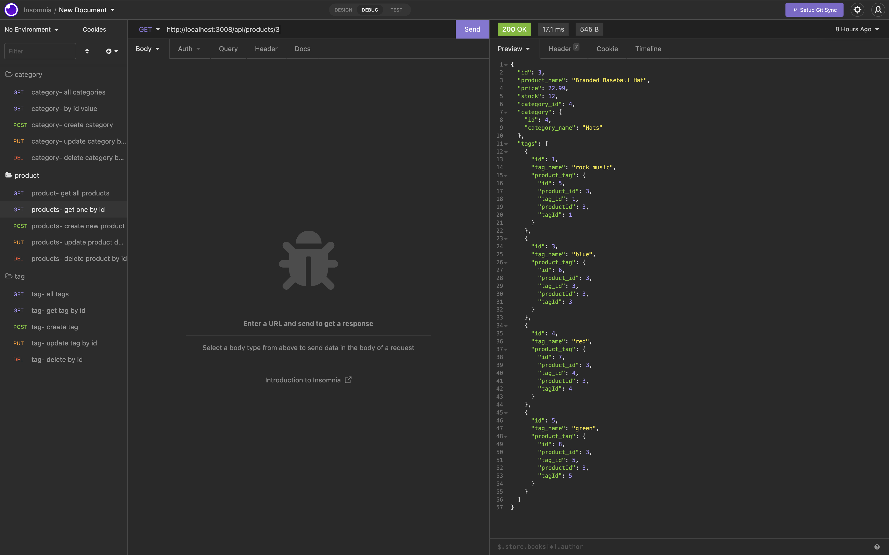

## Welcome to the Ecommerce Application!
----

### This application was made to test the routes of the functionality of several models. The premise is to be able to retrive, update, and delete information from the models. In doing so, we have used the CRUD operations of API's to get the data we need.
---
#### In doing so, I have used Insomnia as the platform to deploy our application. This is an enitrely back end driven, functional application to organize and categorize inventor for businesses.
----

# Langauges Used:

* JAVASCRIPT
* MYSQL
* NODE JS
* EXPRESS
* SEQUELIZE

---
[GitHub Link to Repository](https://github.com/jadehuynh/ecommerce-back-end-app)

----
[Link to Live Video Walkthrough]()

---

# Images of Ecommerce Application

----

----

----

